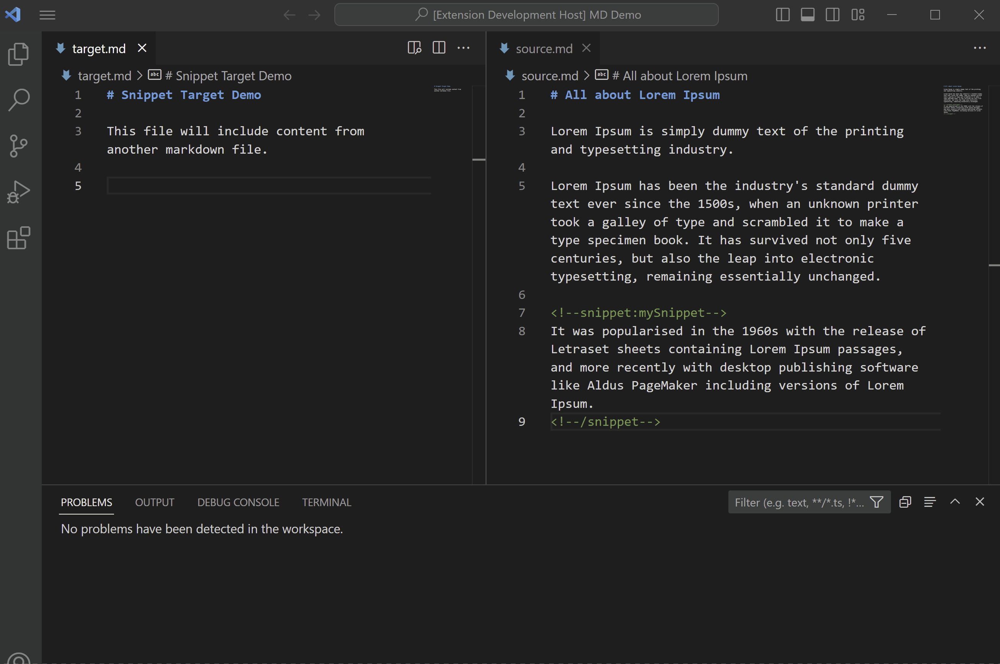

# Markdown Snippet Include README

This extension allows you to specify parts of other files (or even entire files) to include in your markdown documents.  This might be useful to single source things like copyright notices, licensing information, etc, or to include snippets of live code.  This works in a similar way to Doxygen's [\\snippet command](https://www.doxygen.nl/manual/commands.html#cmdsnippet), or Sphinx's [literalinclude directive](https://chiplicity.readthedocs.io/en/latest/Using_Sphinx/ShowingCodeExamplesInSphinx.html#literalinclude-directive).  The primary difference is that with this extension the text is included in the document at edit time instead of at output rendering time.



## Features

You can include snippets in your markdown file using the following syntax:

```
<!-- include:filename#snippetname-->
```

The command `Markdown: Insert Include` inserts a template snippet include.

If no path is provided, the filename is expected to be in the same directory as the markdown file.  You can specify a relative path.

The command `Markdown: Update Includes` updates all the snippet includes in the current document.

The setting "Update Includes On Save" updates all the snippet includes when the current document is saved


The command `Markdown: Update Workspace` updates all the snippet includes in all markdown documents in the workspace.  Note that this command does not report any problems with snippets, such as missing files or snippet names.

The target file should have a snippet defined as such:

### File type: Markdown

File extension: .md

Snippet syntax:
```
<!--snippet:snippetName-->
... content 
<!--/snippet-->
```

Example:
```
<!--snippet:mysnippet2-->
#sceneEmbeddedScript - The source of the script is a scene file (i.e., a scene file embedded script). 

Another line.
<!--/snippet-->
```

### File type: C++

File extension: .cpp, .h

Snippet syntax:

```
//! [mySnippet]
... content
//! [mySnippet]
```

Example:

```cpp
//! [mySnippet]
QtObjectDemo::QtObjectDemo() 
{
	GetQtObjectDemoDesc()->MakeAutoParamBlocks(this);

	// Initialize the float tab with some dummy values
	if ( auto* pblock = GetParamBlockByID(qt_params) )
	{
		float val[4] = {10,20,30,40 };
		pblock->Append(pb_float_tab, 4, val, 10);
	}
}
//! [mySnippet]
```

### File type: Python

File Extension: .py

Snippet syntax:

```
# [snippetName]
... content
# [snippetName]

Example:

```py
# [mySnippet]
# convert python array[3] to mxs as Point3
# required to call some pymxs functions
def array2point3(a):
    pt3 = mxs.Point3(a[0], a[1], a[2])
    return pt3
# [mySnippet]
```

### File type: MAXScript

File Extension: .ms, .msx

Snippet syntax:

```
-- [snippetName]
... content
-- [snippetName]
```

Example:

```
-- [mysnippet]
if f != undefined do ( --if a valid filename picked
    local theFile = openFile f --open the file
	i=0
    while not eof theFile and i<20 do ( --loop until the end of file
		ln =  readline theFile
		i=i+1
    )
)
-- [mysnippet]
```

## Extension Settings

This extension contributes the following settings:

* `mdsnip.updateSnippetsOnSave`: Updates snippets on save.  The default is "false".


## Known Issues

Not yet supported but might be soon:

- Include full file (no snippetName specified)
- absolute file path support - not tested, may or may not work

The update workspace command works, but does not report any errors.


## Release Notes


### 1.0.0

Initial release Markdown Snippet Include!


